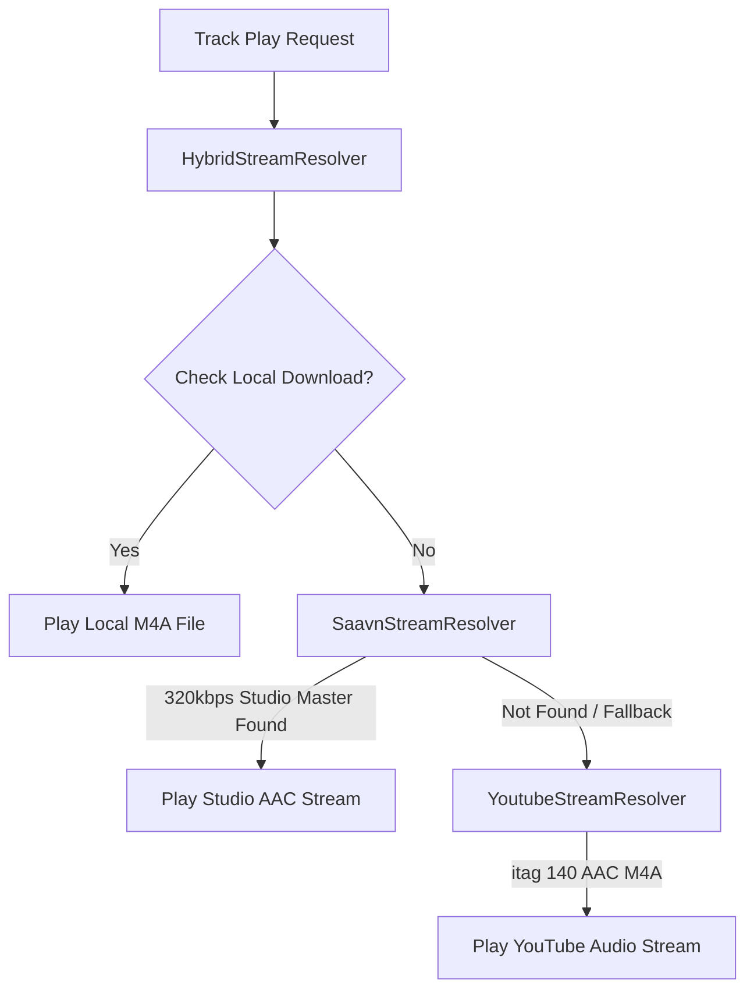

<div align="center">


# Softify

**An ad-free, paywall-free, high-fidelity mobile music streaming application for Android & iOS built with Flutter, Clean Architecture, and 320 kbps Studio Audio.**

[](https://flutter.dev)
[](https://dart.dev)
[](#-downloads--releases)
[](#-audio-engine--quality-settings)
[](#-architecture-highlights)
[](#-testing--quality-gates)
[](#-testing--quality-gates)
[](https://github.com/Sarthak-Cyb3r/softify/releases)
[](LICENSE)

</div>

---

> [!IMPORTANT]
> **This project is built for educational purposes and personal use. It is not affiliated with, endorsed by, or connected to Spotify, YouTube, or JioSaavn. No copyrighted content is hosted on this app.**

> [!NOTE]
> **Beta Status**: Softify is currently in **Beta**, and several features are pending. If bugs are found or you have suggestions, please contact the developer or submit an issue.

---

## 📖 Overview

**Softify** brings the premium music listening experience back to the listener. It delivers unrestricted, high-fidelity music streaming, instant search, synchronized lyrics, custom playlists, and offline downloads without subscriptions, audio or visual advertisements, or account paywalls.

Built from the ground up using **Flutter** and strict **Clean Architecture**, Softify operates entirely **client-side** with zero central backend infrastructure, zero API key requirements, and zero telemetry tracking.

---

## 📱 Screenshots

<div align="center">

| Home & Dynamic Taste | Instant Search & Deduplication | Your Library & Playlists |
|:---:|:---:|:---:|
|  |  |  |

<br/>

| Full-Screen Studio Player | Settings & Audio Controls |
|:---:|:---:|
|  |  |

</div>

---

## 📥 Downloads & Releases

Download pre-compiled binaries directly from [GitHub Releases](https://github.com/Sarthak-Cyb3r/softify/releases):

| Platform | Format | Compatibility | Size | Link |
| :--- | :--- | :--- | :--- | :--- |
| **Android (Universal)** | `.apk` | All Android devices (ARM64, ARMv7, x86_64) • Android 8.0+ | ~68 MB | [`Softify-v2.0.6-beta-0.2-Android-Universal.apk`](https://github.com/Sarthak-Cyb3r/softify/releases/latest) |
| **iOS (Sideload / AltStore)** | `.ipa` | iPhone & iPad • iOS 15.0+ | ~10.4 MB | [`Softify-iOS-Universal.ipa`](https://github.com/Sarthak-Cyb3r/softify/releases/latest) |
| **Linux (Desktop / CLI Installer)** | Script / Binary | Ubuntu, Debian, Arch, Fedora, openSUSE (x86_64, ARM64) | ~45 MB | [`install.sh`](https://raw.githubusercontent.com/Sarthak-Cyb3r/softify/main/install.sh) |

### 🐧 Linux Installation (Terminal-Based):
Softify provides a native, low-memory-conscious terminal installer with automatic package manager detection, desktop integration (`.desktop`, icons), and hardware-aware build throttling.

#### One-Line Installation:
```bash
curl -fsSL https://raw.githubusercontent.com/Sarthak-Cyb3r/softify/main/install.sh | bash
```

#### From Local Repository:
```bash
chmod +x install.sh
./install.sh
```

#### Installer Options:
- `./install.sh --build` : Build and install native Linux binary from local source code (auto-restricts to single-thread compilation on $\le 5$ GB RAM systems to prevent memory exhaustion).
- `./install.sh --system`: Install system-wide into `/usr/local/bin` (requires `sudo`).
- `./install.sh --uninstall`: Cleanly remove binary, desktop launcher, and application icons.
- `./install.sh --yes`: Unattended non-interactive install.

#### 🔄 Updating on Linux:
To update Softify on Linux to the latest version, simply run the one-line installer command (your playlists, downloaded tracks, and settings are preserved):
```bash
curl -fsSL https://raw.githubusercontent.com/Sarthak-Cyb3r/softify/main/install.sh | bash
```

To update or pin to a specific release tag (e.g. `v2.0.5`):
```bash
curl -fsSL https://raw.githubusercontent.com/Sarthak-Cyb3r/softify/main/install.sh | SOFTIFY_VERSION=v2.0.5 bash
```

If you installed from a local git repository:
```bash
git pull
./install.sh
```

#### ⌨️ Desktop Keyboard Shortcuts:
| Shortcut | Action |
| :--- | :--- |
| `Space` | Toggle Play / Pause |
| `Ctrl` + `→` | Skip to Next Track |
| `Ctrl` + `←` | Previous Track |
| `Ctrl` + `↑` / `Ctrl` + `↓` | Volume Up / Down (5% step) |
| `Ctrl` + `S` or `Ctrl` + `F` | Focus Search Screen |
| `Ctrl` + `H` | Navigate to Home Screen |
| `Ctrl` + `L` | Navigate to Library Screen |
| `Ctrl` + `,` | Open Settings Screen |

### 🤖 Android Installation:
1. Download **`Softify-v2.0.2-Android-Universal.apk`** from [GitHub Releases](https://github.com/Sarthak-Cyb3r/softify/releases/latest).
2. Tap the `.apk` file in your browser downloads or file manager.
3. Grant **"Allow from this source"** in Android Settings if prompted, then tap **Install**.

### Android release signing
Production APKs **must** be signed with the stable release keystore `android/app/softify-release.jks` (key alias `softify`) configured through `android/key.properties` (`storeFile`, `storePassword`, `keyAlias`, `keyPassword`). Both files are **gitignored** and must never be committed.

CI injects them at build time from GitHub Actions secrets:

| Secret | Contents |
| :--- | :--- |
| `ANDROID_KEYSTORE_BASE64` | Base64-encoded `softify-release.jks` |
| `ANDROID_KEYSTORE_PASSWORD` | Keystore password |
| `ANDROID_KEY_ALIAS` | Key alias (defaults to `softify`) |
| `ANDROID_KEY_PASSWORD` | Key password |

```bash
# Store the keystore as base64
base64 -w0 android/app/softify-release.jks | gh secret set ANDROID_KEYSTORE_BASE64
gh secret set ANDROID_KEYSTORE_PASSWORD
gh secret set ANDROID_KEY_ALIAS
gh secret set ANDROID_KEY_PASSWORD
```

> [!WARNING]
> **Losing the keystore or its passwords makes future updates impossible** — there is no recovery path. Back it up offline (encrypted drive / password manager), separate from the repository. If the signing key ever changes, existing installs will show a signature conflict **once**; users must uninstall and reinstall the app.

**Cutting an Android release**: bump `version:` in `pubspec.yaml`, tag `vX.Y.Z`, push the tag — the *Release Build (Android)* workflow enforces that the tag matches `pubspec.yaml`, then builds, verifies, and uploads the signed APK:
```bash
git tag v2.0.1 && git push origin v2.0.1
```

### 🍎 iOS Installation & Sideloading Guide:
Because Softify is open-source and not distributed via the App Store, iOS users can install **`Softify-iOS-Universal.ipa`** using standard iOS sideloading tools:

#### Option 1: Sideloadly (Recommended for Windows & Mac)
1. Download and install [Sideloadly](https://sideloadly.io/) on your PC or Mac.
2. Connect your iPhone or iPad via USB cable (or enable Wi-Fi sync in iTunes/Finder).
3. Download **`Softify-iOS-Universal.ipa`** from [GitHub Releases](https://github.com/Sarthak-Cyb3r/softify/releases).
4. Drag and drop the `.ipa` into the Sideloadly window.
5. Enter your Apple ID and click **Start**.
6. Once installed, go to **Settings → General → VPN & Device Management** on your iPhone, select your Apple ID, and tap **Trust**.

#### Option 2: AltStore / SideStore (Wireless On-Device Refresh)
1. Install [AltStore](https://altstore.io/) or [SideStore](https://sidestore.io/) on your device.
2. Download **`Softify-iOS-Universal.ipa`** on your iPhone using Safari.
3. Open AltStore, tap the **My Apps** tab, tap the **`+`** icon in the top corner, and select the downloaded IPA.
4. AltStore will sign and install Softify, automatically refreshing its certificate over your local Wi-Fi network.

#### Option 3: TrollStore (iOS 14.0 – 17.0)
If your device is running a TrollStore-compatible iOS version:
1. Download **`Softify-iOS-Universal.ipa`** in Safari.
2. Tap the Share sheet → Select **Open in TrollStore**.
3. Softify will install instantly and **permanently** without 7-day certificate expiration or app limits.

> [!TIP]
> **First-Time iOS Launch**: If iOS displays *"Untrusted Developer"*, simply open **Settings → Privacy & Security → Developer Mode** (enable and reboot if on iOS 16+) and trust your profile in **Settings → General → VPN & Device Management**.

---

## 🚀 How to Use Softify (Feature Guide)

### 1. 🏠 Home Screen & Taste-Based Discovery
- **Personalized Greeting**: Softify greets you dynamically (*Good morning / afternoon / evening, [Name]*). You can tap your name in Settings anytime to customize it.
- **Taste-Based Featured Section**: Softify analyzes your recent listening history and liked tracks to dynamically generate personalized recommendations with context subtitles (*"Based on your recent listening"*).
- **Quick Picks & Trending Hits**: Discover trending studio tracks and evergreen chart-toppers curated directly from official label charts.

### 2. 🔍 Search & Smart Deduplication
- **Debounced Instant Search**: Type any song, artist, movie, or album. Softify queries both official studio catalogs and audio streams with 400ms debouncing and autocomplete suggestions.
- **Anti-Mashup & Smart Deduplication**: Unlike standard YouTube searches that return 20+ low-quality remix clones, slowed+reverb edits, or movie dialogue skits, Softify automatically:
  - Collapses duplicate compilations into the single original studio master.
  - Strips noisy movie intro dialogues and mid-track skits.
  - Guarantees high-resolution (500x500) album artwork.
- **Browse by Genre**: Tap on genre cards (Bollywood, Pop, Hip-Hop, Punjabi, Rock, Indie, Lo-Fi) to explore curated playlists instantly.

### 3. 🎵 Music Playback & Full-Screen Player
- **Persistent MiniPlayer**: While browsing other screens, the bottom MiniPlayer keeps playback running with track details, artwork, and quick Play/Pause controls.
- **Expanding the Player**: Tap or swipe up on the MiniPlayer to open the immersive **Full-Screen Player**.
- **Playback Controls**:
  - **Seek Bar / Scrubber**: Drag the scrubber to any position with live timestamp indicators.
  - **Shuffle**: Toggle random track progression with one tap.
  - **Repeat Modes**: Tap to cycle between **Repeat Off**, **Repeat Queue**, and **Repeat One Track**.
  - **Favorite (Heart)**: Tap the heart icon to instantly save the track to your Liked Songs.

### 4. 🎤 Synchronized Karaoke Lyrics
- **Opening Lyrics**: Inside the Full-Screen Player, tap the **Lyrics** icon in the bottom action bar.
- **Live Karaoke Auto-Scroll**: Synced lyrics powered by LRCLIB follow the vocal performance in real-time, highlighting the current line as it sings.
- **Seek-on-Tap**: Tap any upcoming or past lyric line to immediately seek playback to that exact timestamp in the song.
- **Offline Caching**: Lyrics are automatically cached in your local SQLite database for instant offline viewing.

### 5. 📻 Smart Queue, Autoplay & Automix Radio
- **Queue Management**: View upcoming tracks by opening the queue sheet. You can manually reorder tracks or dismiss songs you don't want to hear.
- **Continuous Autoplay**: When your active queue ends, Softify's recommendation engine pre-fetches musically coherent tracks based on the current song.
- **Strict Genre & Mood Isolation**:
  - Listening to English pop/rock? Softify will **never** inject unrelated regional tracks.
  - Listening to high-energy party bangers? Softify isolates the mood so romantic slow songs or sad acoustic tracks won't interrupt your vibe.
  - Zero fan-made mashups, podcasts, or noisy bootlegs in recommendations.

### 6. 📚 Library, Playlists & Favorites
- **Liked Songs**: Access all favorited songs in one clean playlist with batch playback and shuffle options.
- **Custom Playlists**: Tap **+ Create Playlist** in the Library tab to create your own collections. Add or remove tracks anytime from the three-dot context menu on any song.
- **Listening History**: View your chronological listening history, automatically deduplicated so recently repeated tracks cleanly surface to the top.

### 7. 📥 Direct Offline Downloads
- **1-Tap Download**: Tap the Download button on any track to save it directly to your device storage.
- **Native iTunes MP4 Atom Tagging**: Downloaded files are stored in standard `.m4a` format with embedded ID3/iTunes atoms (`©nam`, `©ART`, `©alb`, `covr`), making them fully readable with album artwork by native Android media players and file managers.
- **Offline Storage Management**: Navigate to **Library → Downloads** to manage offline tracks, view total disk usage, and delete downloads with disk-first verification.

### 8. 🔄 1-Click Spotify Playlist Importer
- **Zero API Key Requirement**: Easily import public Spotify playlists without registering for developer tokens or logging into Spotify.
- **How to Import**:
  1. In Spotify, tap **Share → Copy Link** on any public playlist.
  2. In Softify, open **Library → Import Playlist** and paste the URL (or playlist ID).
  3. Softify parses the playlist metadata and matches each track to its 320 kbps studio master recording.
  4. Tap **Import All** to add all matched tracks directly to your Softify library.

### 9. ⚙️ Audio Engine & Quality Settings
- **Audio Quality Presets**: Choose your preferred stream fidelity in Settings:
  - **High (320 kbps)**: Authentic studio master CD-quality audio directly from official music label CDNs.
  - **Medium (160 kbps)**: Balanced fidelity and bandwidth for mobile data.
  - **Low (96 kbps)**: Data-saver mode for limited connectivity.
- **Cache Management**: One-tap tools to clear lyrics cache or reset application cache.
- **Built-in Direct GitHub Updater**: Check and download updates directly within Settings with live download progress, SHA-256 integrity verification, and one-tap Android installer launch.

### 10. 🍎 Native iOS Experience & Audio Session
- **Lock Screen & Dynamic Island (MPRemoteCommandCenter)**: Full native iOS media integration with live album art, track scrub bar, and interactive playback controls.
- **AirPods & Bluetooth Integration**: Full hardware support for stem-click / squeeze gestures (single tap to pause/resume, double tap to skip, triple tap to rewind) and volume sync.
- **Apple CarPlay Audio**: Seamless background streaming when connected to Apple CarPlay or car audio systems via Bluetooth or USB.
- **Sandboxed Offline Downloads**: Offline audio tracks are stored directly in your device's isolated application sandbox, fully protected and accessible without needing mobile data or Wi-Fi.
- **Apple Privacy Manifest**: Compliant with Apple's Spring 2024 Privacy Manifest (`PrivacyInfo.xcprivacy`) — 0 third-party trackers and 0 telemetry collection.

---

## 🧠 Softify v2.0 On-Device Intelligence & Recommendation Engine

Softify v2.0 introduces a state-of-the-art, **100% client-side, zero-telemetry** recommendation and search intelligence engine running entirely on local SQLite/Drift tables without any remote machine learning servers:

### 1. ⚡ Local-First Instant Search & FTS5 Retrieval (S1, S2, S3)
- **Sub-100ms Latency Budget**: Instant debounced search (120ms debounce) that prioritizes local results before blending remote catalog hits.
- **SQLite FTS5 Virtual Table**: Full-text prefix indexing across tracks, artists, and playlists with diacritic normalization and punctuation stripping.
- **Fuzzy Damerau-Levenshtein Matching & Aliases**: Seamless handling of typos, spelling variants, and curated music aliases.
- **Linear Re-Ranker with Exact-Match Invariant**: Blends BM25 lexical signals, recency, and stream history with a hard `+10.0` score boost ensuring exact search matches always rank #1.

### 2. 📈 Dual-Band Taste Decay & Co-occurrence Sentence Graph (R1, R2)
- **Dual-Band Half-Life Decay**: Models user affinity with two concurrent exponential decay bands:
  - Fast-decay band ($W_{\text{fast}}$: 4-hour half-life) capturing immediate listening moods and session trends.
  - Slow-decay band ($W_{\text{slow}}$: 14-day half-life) capturing enduring genre and artist taste.
- **Session Sentence Graph & PPMI**: Treats listening sessions (interrupted by $\le 60\text{s}$ gaps) as natural language "sentences" to compute Positive Pointwise Mutual Information (PPMI) between co-occurring tracks off the main thread.

### 3. 🎯 Pointwise Logistic Regression & Algotorial Shelves (R3, R4)
- **On-Device SGD Model**: Computes stream probabilities $\sigma(z) = 1/(1+e^{-z})$ directly on device from features including taste affinity, recency, skip penalties, and source weights.
- **Skip Sensitivity Rule**: Dynamically applies a $>50\%$ penalty when an artist or track suffers $\ge 3$ consecutive skips.
- **Dynamic Algotorial Shelves**:
  - *Heavy Rotation*: High-affinity tracks weighted by both slow and fast taste bands.
  - *Forgotten Favorites*: Deep catalog gems not listened to in $>30$ days.
  - *Discover Weekly*: Curated discovery with a strict **~10% familiar anchor ratio** (1 anchor track per 10 recommendations) to ground exploration in familiar favorites.

### 4. 🧭 Multi-Source Autocomplete & Offline Intent Routing (S4, S5)
- **Multi-Source Sealed Intent Autocomplete**: Merges candidate suggestions from 5 distinct sources (recent queries, library matches, cached history, popular artists, and fuzzy matches).
- **Rule-Based Intent Router**: Instantly classifies user queries into structured intents (`TrackIntent`, `ArtistIntent`, `MoodOrGenreIntent`, `DiscoverIntent`, or `NavigationalIntent`) without remote LLM latency.

### 5. 🔀 Dynamic Queue Reordering & Pre-Buffer Invariant (R5, R6)
- **Player Pre-Buffer Invariant**: The secondary player engine pre-buffers track $N+1$ approximately 15 seconds before track $N$ completes. Softify strictly guarantees that **Track $N$ and Track $N+1$ are never mutated, re-ordered, or canceled**. Re-ranking occurs exclusively on the unbuffered tail ($\ge N+2$).
- **Contextual Epsilon-Greedy Bandit**: Balances exploitation with exploration across novelty arms (`0.0, 0.1, 0.2, 0.3, 0.5`) to prevent recommendation echo-chambers.
- **Kullback-Leibler (KL) Divergence Calibration**: Calibrates recommended genre distributions against historical listening profiles, minimizing $D_{\text{KL}}(P \parallel Q)$.

### 6. 🛡️ Discovery Agency, MMR Diversity & Privacy Controls (R7, R8)
- **Maximal Marginal Relevance (MMR)**: Penalizes redundant artists with a hard `maxPerArtist = 2` cap per recommendation shelf.
- **30-Day Artist Snoozing**: 1-tap option to temporarily exclude any artist from recommendations and autocomplete for 30 days.
- **Incognito Taste Mode**: Pause all profile learning during shared or party sessions.
- **1-Line Transparent Explanations**: Every recommendation surfaces a clear rationale (*"Because you listened to The Weeknd"*, *"From your Heavy Rotation"*).
- **Cold-Start Seeding**: Seamless onboarding genre selection and instant taste profile seeding from imported Spotify playlists.

### 7. ⚖️ Radlinski Team-Draft Interleaving & Latency Guardrails (E1, E2)
- **On-Device Team-Draft Interleaving**: Fairly evaluates candidate ranking models in vivo with a 10% baseline holdback slot to measure true user preference without telemetry.
- **Automated Latency Guardrails**: Continuous verification requiring search responses to pass $p75 < 100\text{ ms}$ over 50 consecutive queries.
- **Golden Query Suite**: 54 diverse benchmark queries spanning popular artists, exact titles, typos, and multi-lingual transliterations.

### 8. 🧬 On-Device Semantic Vector Search (E3)
- **128-Dimensional Float32 Embeddings**: Compact local vector representations computed via subword character trigram and word hash projections.
- **Zero-Network Vector Retrieval**: L2-normalized cosine similarity computed directly against SQLite `track_embeddings` table. Adds $<1\text{ MB}$ to binary size with zero 100MB+ TensorFlow Lite dependencies.

---

## 🏛️ Architecture Highlights

Softify is built upon strict **Clean Architecture** principles, maintaining absolute decoupling between business logic, external infrastructure, and UI presentation:

```
lib/
├── domain/                    # Pure Dart business rules (Zero Flutter/Drift dependencies)
│   ├── entities/              # Track, SearchCandidate, SearchIntent, AudioQualityPreset, Playlist
│   └── ports/                 # Inverted interfaces (IStreamResolver, IVectorSearchEngine, etc.)
├── data/                      # Concrete data providers & on-device machine learning
│   ├── catalog/               # KeylessYouTubeCatalog (Deduplication + Autocomplete)
│   ├── database/              # Drift SQLite relational ORM (AppDatabase with 20 tables + FTS5)
│   ├── evaluation/            # TeamDraftInterleaver, GuardrailRunner (Latency & Golden Benchmarks)
│   ├── player/                # SoftifyAudioHandler (Dual-engine pre-buffering pipeline)
│   ├── recommendations/       # Taste profiles, PPMI graph, LogisticRanker, ShelfEngine, MMR, Bandit
│   ├── repositories/          # DriftLibraryRepository, DriftEventLogger, DriftFtsRepository
│   ├── resolvers/             # SaavnStreamResolver (320kbps), YoutubeStreamResolver, HybridStreamResolver
│   ├── search/                # VectorSearchEngine, LinearSearchReranker, RuleIntentRouter
│   └── tagging/               # M4aAtomTagger (iTunes MP4 atom tagging)
└── presentation/              # Reactive UI layer (Flutter + Riverpod)
    ├── providers/             # Cached Riverpod audio, queue, search, and settings providers
    ├── screens/               # HomeScreen, SearchScreen, LibraryScreen, FullScreenPlayerScreen, DebugMetricsScreen
    └── widgets/               # MiniPlayer, LyricsView, QueueBottomSheet, IntentSuggestionChips
```

### Hybrid Resolution Chain


---

## 🛠️ Building from Source

### Prerequisites
- [Flutter SDK](https://flutter.dev/docs/get-started/install) (`>= 3.19.0`, recommended `3.47.6` or latest stable)
- [Dart SDK](https://dart.dev) (`>= 3.3.0`)
- [Android SDK](https://developer.android.com/studio) (API 34+ recommended, minimum API 26)
- Java Development Kit (JDK 17+)

### Step-by-Step Build Instructions

1. **Clone the repository**:
   ```bash
   git clone https://github.com/Sarthak-Cyb3r/softify.git
   cd softify
   ```

2. **Install Flutter dependencies**:
   ```bash
   flutter pub get
   ```

3. **Generate Drift SQLite code**:
   ```bash
   dart run build_runner build --delete-conflicting-outputs
   ```

4. **Run static analysis and tests**:
   ```bash
   flutter analyze
   flutter test
   ```

5. **Build Android Release (Universal APK)**:
   ```bash
   flutter build apk --release
   ```
   The compiled APK will be at `build/app/outputs/flutter-apk/app-release.apk`.

6. **Build iOS Release (macOS with Xcode 15+)**:
   ```bash
   # Compile iOS Release Archive (Swift Package Manager, no CocoaPods step)
   flutter build ipa --no-codesign --release

   # Package into Sideloadable IPA
   cd build/ios/archive/Runner.xcarchive/Products/Applications
   mkdir -p Payload && cp -r Runner.app Payload/
   zip -r ../../../../../Softify-iOS-Universal.ipa Payload && cd ../../../../..
   ```

---

## 🧪 Testing & Quality Gates

Softify maintains strict quality engineering standards with 100% test coverage for critical domain rules and resolvers:

```bash
# Run the complete automated test suite
flutter test

# Run static analysis
flutter analyze
```

- **Analysis Status**: `0 issues found` (clean lint profile).
- **Unit & Integration Tests**: `170/170 tests passing (100%)`.
- **Test Corpus**: Validates all Sprints 1 to 9:
  - Telemetry & Event Logging (`DriftEventLogger`, 30s stream rule, fire-and-forget execution)
  - FTS5 Full-Text Retrieval & Fuzzy Aliases (`DriftFtsRepository`, `TextNormalizer`, `LinearSearchReranker`)
  - Taste Decay & PPMI Co-occurrence Graph (`DriftTasteProfileRepository`, `DriftCooccurrenceRepository`)
  - Pointwise Logistic Regression Ranker & Algotorial Shelves (`LogisticRegressionRanker`, `ShelfEngine` 10% anchor rule)
  - Autocomplete & Intent Routing (`MultiSourceAutocomplete`, `RuleIntentRouter`)
  - Automix Tail Reordering & Untouchable $N+1$ Pre-buffer Invariant (`AutomixTailReorderer`, `EpsilonGreedyBandit`, `KlDivergenceCalibrator`)
  - MMR Diversity & Discovery Agency (`MmrDiversityRanker`, 30-day artist snooze, Spotify cold-start seeder)
  - Team-Draft Interleaving & Latency Guardrails (`TeamDraftInterleaver`, `GuardrailRunner`, 54 golden query benchmarks)
  - Semantic Vector Search (`VectorSearchEngine`, cosine similarity, 128-dim subword trigram vector hashing)
  - Core Audio & Stream Engines (`SaavnStreamResolver` 320kbps verification, `HybridStreamResolver`, `YoutubeStreamResolver`, `M4aAtomTagger`, `SoftifyAudioHandler`)

---

## 🤖 AI-Assisted Changes

Assisted by **`Antigravity`** & **`opencode/mimo-v2.6-flash-free`**.

| Milestone | Key Implementations & Guardrails |
|---|---|
| **v2.0.0 (Search & Recommendations)** | Implemented the complete 17-feature search and recommendation roadmap (Sprints 1–9) with 100% on-device SQLite/Drift persistence (Schemas v2–v9), sub-100ms instant search, FTS5 full-text indexing, dual-band taste decay ($W_{\text{fast}}$: 4h, $W_{\text{slow}}$: 14d), session co-occurrence graph (PPMI), pointwise logistic regression ranker, algotorial home shelves with 10% familiar anchor ratio, multi-source autocomplete, rule-based intent router, automix tail reordering respecting the untouchable $N+1$ player pre-buffer invariant, $\varepsilon$-greedy bandit with KL calibration, MMR diversity ranker with hard `maxPerArtist = 2` cap, 30-day artist snoozing, Radlinski team-draft interleaving with 10% holdback, 54-query golden benchmark latency runner, and 128-dim zero-network semantic vector search. All 170/170 tests pass cleanly with 0 lint issues. |
| **v1.0.1 (Audio & Platform Stability)** | Eliminated song transition latency (<10ms) using a dual-engine standby pre-buffering pipeline in `JustAudioPlayerAdapter`. Fixed offline download audio playback by dynamically recalculating ISO-BMFF MP4 sample table chunk offsets (`stco`/`co64`) in `M4aAtomTagger` with automatic on-the-fly healing. Connected in-app OTA updater directly to GitHub Releases. |
| `d72f048` | Removed vestigial `ios/Podfile` in favor of Swift Package Manager for clean Xcode archiving. |
| `4532c2c` | `watchPlayHistory` tie-breaks `playedAt` with `id DESC` for consistent millisecond re-plays. |

Result: Production-ready v2.0.0 milestone with all 17 roadmap features fully integrated and verified.

---

## ⚖️ Legal & Disclaimer

> [!IMPORTANT]
> **This project is built for educational purposes and personal use. It is not affiliated with, endorsed by, or connected to Spotify, YouTube, or JioSaavn. No copyrighted content is hosted on this app.**

- Softify does not bypass or circumvent any digital rights management (DRM) or proprietary encryption mechanisms.
- All metadata and audio streams are retrieved client-side from publicly available endpoints.
- Users are solely responsible for ensuring their personal use complies with local laws and terms of service.

---

## 📄 License

Softify is distributed under the [MIT License](LICENSE).
