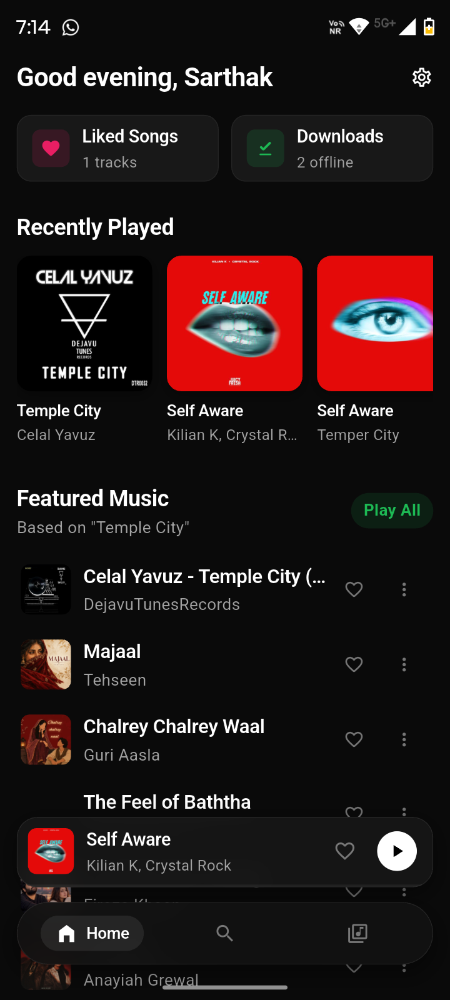
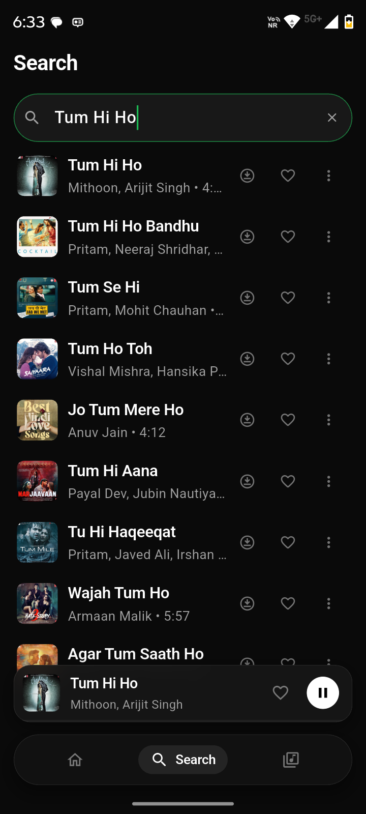
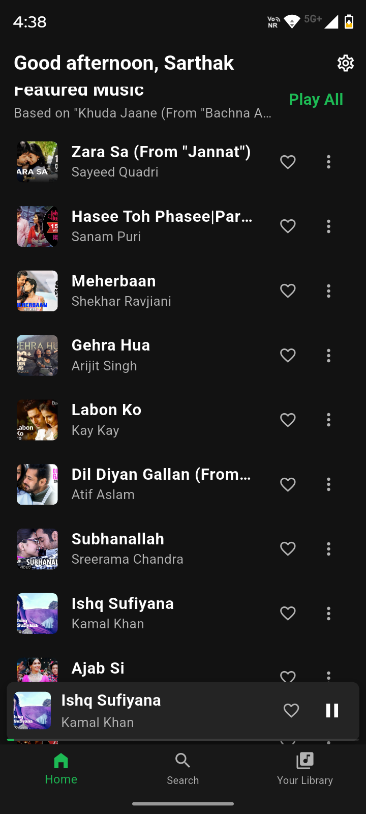
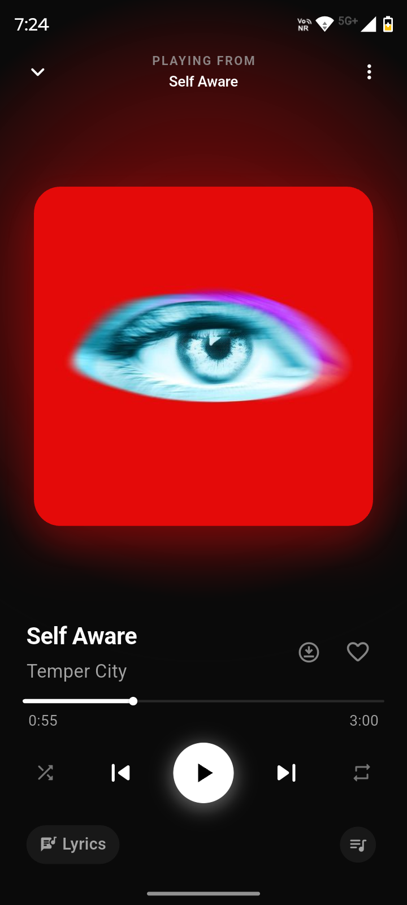
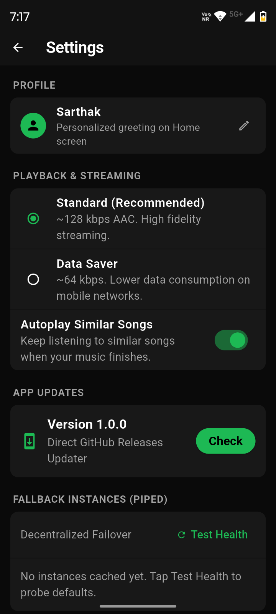
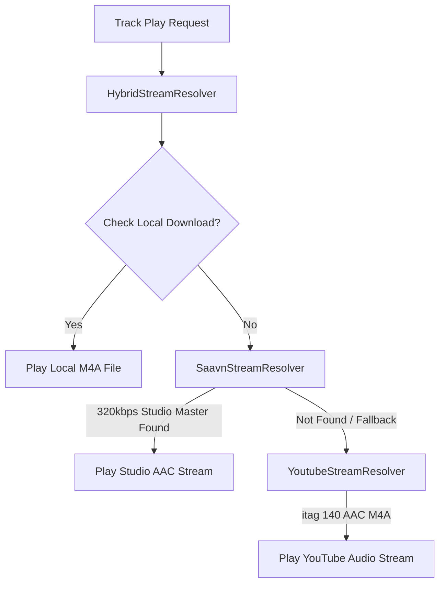

<div align="center">


# Softify

**An ad-free, paywall-free, high-fidelity mobile music streaming application for Android & iOS built with Flutter, Clean Architecture, and 320 kbps Studio Audio.**

[](https://flutter.dev)
[](https://dart.dev)
[](#-downloads--releases)
[](#-audio-engine--quality-settings)
[](#-architecture-highlights)
[](#-testing--quality-gates)
[](#-testing--quality-gates)
[](#-beta-status-feedback--contact)
[](LICENSE)

</div>

---

> [!IMPORTANT]
> **This project is built for educational purposes and personal use. It is not affiliated with, endorsed by, or connected to Spotify, YouTube, or JioSaavn. No copyrighted content is hosted on this app.**

> [!NOTE]
> **Beta Status**: Softify is currently in **Beta**, and several features are pending. If bugs are found or you have suggestions, please contact the developer or submit an issue.

---

## 📖 Overview

**Softify** brings the premium music listening experience back to the listener. It delivers unrestricted, high-fidelity music streaming, instant search, synchronized lyrics, custom playlists, and offline downloads without subscriptions, audio or visual advertisements, or account paywalls.

Built from the ground up using **Flutter** and strict **Clean Architecture**, Softify operates entirely **client-side** with zero central backend infrastructure, zero API key requirements, and zero telemetry tracking.

---

## 📱 Screenshots

<div align="center">

| Home & Dynamic Taste | Instant Search & Deduplication | Your Library & Playlists |
|:---:|:---:|:---:|
|  |  |  |

<br/>

| Full-Screen Studio Player | Settings & Audio Controls |
|:---:|:---:|
|  |  |

</div>

---

## 📥 Downloads & Releases

Download pre-compiled binaries directly from [GitHub Releases](https://github.com/Sarthak-Cyb3r/softify/releases):

| Platform | Format | Compatibility | Size | Link |
| :--- | :--- | :--- | :--- | :--- |
| **Android (Universal)** | `.apk` | All Android devices (ARM64, ARMv7, x86_64) • Android 8.0+ | ~68 MB | [`Softify-v1.0.0-Universal.apk`](https://github.com/Sarthak-Cyb3r/softify/releases/latest) |
| **iOS (Sideload / AltStore)** | `.ipa` | iPhone & iPad • iOS 15.0+ | ~25 MB | [GitHub Actions Workflow](https://github.com/Sarthak-Cyb3r/softify/actions) |

### Android Installation:
1. Download **`Softify-v1.0.0-Universal.apk`** to your device.
2. Tap the file in your browser downloads or file manager.
3. Grant **"Allow from this source"** permission if prompted, then tap **Install**.

### iOS Sideloading (AltStore, SideStore, TrollStore, Sideloadly):
1. Download the latest **`Softify-iOS-Universal.ipa`** from [GitHub Releases](https://github.com/Sarthak-Cyb3r/softify/releases).
2. Sideload via **AltStore**, **SideStore**, **TrollStore**, or **Sideloadly**.
3. On your iPhone, navigate to **Settings → General → VPN & Device Management** and trust your developer certificate.
4. Launch Softify and enjoy ad-free background streaming!

---

## 🚀 How to Use Softify (Feature Guide)

### 1. 🏠 Home Screen & Taste-Based Discovery
- **Personalized Greeting**: Softify greets you dynamically (*Good morning / afternoon / evening, [Name]*). You can tap your name in Settings anytime to customize it.
- **Taste-Based Featured Section**: Softify analyzes your recent listening history and liked tracks to dynamically generate personalized recommendations with context subtitles (*"Based on your recent listening"*).
- **Quick Picks & Trending Hits**: Discover trending studio tracks and evergreen chart-toppers curated directly from official label charts.

### 2. 🔍 Search & Smart Deduplication
- **Debounced Instant Search**: Type any song, artist, movie, or album. Softify queries both official studio catalogs and audio streams with 400ms debouncing and autocomplete suggestions.
- **Anti-Mashup & Smart Deduplication**: Unlike standard YouTube searches that return 20+ low-quality remix clones, slowed+reverb edits, or movie dialogue skits, Softify automatically:
  - Collapses duplicate compilations into the single original studio master.
  - Strips noisy movie intro dialogues and mid-track skits.
  - Guarantees high-resolution (500x500) album artwork.
- **Browse by Genre**: Tap on genre cards (Bollywood, Pop, Hip-Hop, Punjabi, Rock, Indie, Lo-Fi) to explore curated playlists instantly.

### 3. 🎵 Music Playback & Full-Screen Player
- **Persistent MiniPlayer**: While browsing other screens, the bottom MiniPlayer keeps playback running with track details, artwork, and quick Play/Pause controls.
- **Expanding the Player**: Tap or swipe up on the MiniPlayer to open the immersive **Full-Screen Player**.
- **Playback Controls**:
  - **Seek Bar / Scrubber**: Drag the scrubber to any position with live timestamp indicators.
  - **Shuffle**: Toggle random track progression with one tap.
  - **Repeat Modes**: Tap to cycle between **Repeat Off**, **Repeat Queue**, and **Repeat One Track**.
  - **Favorite (Heart)**: Tap the heart icon to instantly save the track to your Liked Songs.

### 4. 🎤 Synchronized Karaoke Lyrics
- **Opening Lyrics**: Inside the Full-Screen Player, tap the **Lyrics** icon in the bottom action bar.
- **Live Karaoke Auto-Scroll**: Synced lyrics powered by LRCLIB follow the vocal performance in real-time, highlighting the current line as it sings.
- **Seek-on-Tap**: Tap any upcoming or past lyric line to immediately seek playback to that exact timestamp in the song.
- **Offline Caching**: Lyrics are automatically cached in your local SQLite database for instant offline viewing.

### 5. 📻 Smart Queue, Autoplay & Automix Radio
- **Queue Management**: View upcoming tracks by opening the queue sheet. You can manually reorder tracks or dismiss songs you don't want to hear.
- **Continuous Autoplay**: When your active queue ends, Softify's recommendation engine pre-fetches musically coherent tracks based on the current song.
- **Strict Genre & Mood Isolation**:
  - Listening to English pop/rock? Softify will **never** inject unrelated regional tracks.
  - Listening to high-energy party bangers? Softify isolates the mood so romantic slow songs or sad acoustic tracks won't interrupt your vibe.
  - Zero fan-made mashups, podcasts, or noisy bootlegs in recommendations.

### 6. 📚 Library, Playlists & Favorites
- **Liked Songs**: Access all favorited songs in one clean playlist with batch playback and shuffle options.
- **Custom Playlists**: Tap **+ Create Playlist** in the Library tab to create your own collections. Add or remove tracks anytime from the three-dot context menu on any song.
- **Listening History**: View your chronological listening history, automatically deduplicated so recently repeated tracks cleanly surface to the top.

### 7. 📥 Direct Offline Downloads
- **1-Tap Download**: Tap the Download button on any track to save it directly to your device storage.
- **Native iTunes MP4 Atom Tagging**: Downloaded files are stored in standard `.m4a` format with embedded ID3/iTunes atoms (`©nam`, `©ART`, `©alb`, `covr`), making them fully readable with album artwork by native Android media players and file managers.
- **Offline Storage Management**: Navigate to **Library → Downloads** to manage offline tracks, view total disk usage, and delete downloads with disk-first verification.

### 8. 🔄 1-Click Spotify Playlist Importer
- **Zero API Key Requirement**: Easily import public Spotify playlists without registering for developer tokens or logging into Spotify.
- **How to Import**:
  1. In Spotify, tap **Share → Copy Link** on any public playlist.
  2. In Softify, open **Library → Import Playlist** and paste the URL (or playlist ID).
  3. Softify parses the playlist metadata and matches each track to its 320 kbps studio master recording.
  4. Tap **Import All** to add all matched tracks directly to your Softify library.

### 9. ⚙️ Audio Engine & Quality Settings
- **Audio Quality Presets**: Choose your preferred stream fidelity in Settings:
  - **High (320 kbps)**: Authentic studio master CD-quality audio directly from official music label CDNs.
  - **Medium (160 kbps)**: Balanced fidelity and bandwidth for mobile data.
  - **Low (96 kbps)**: Data-saver mode for limited connectivity.
- **Cache Management**: One-tap tools to clear lyrics cache or reset application cache.
- **Built-in GitHub Updater**: Check for new releases directly within Settings with SHA-256 integrity validation.

---

## 🏛️ Architecture Highlights

Softify is built upon strict **Clean Architecture** principles, maintaining absolute decoupling between business logic, external infrastructure, and UI presentation:

```
lib/
├── domain/                    # Pure Dart business rules (No Flutter/UI dependencies)
│   ├── entities/              # Track, StreamInfo, AudioQualityPreset, Playlist
│   └── ports/                 # Inverted interfaces (IStreamResolver, ICatalogRepository, etc.)
├── data/                      # Concrete data providers & external infrastructure
│   ├── catalog/               # KeylessYouTubeCatalog (Deduplication + Autocomplete)
│   ├── database/              # Drift SQLite relational ORM (AppDatabase with 10 tables)
│   ├── player/                # SoftifyAudioHandler (audio_service + just_audio engine)
│   ├── repositories/          # DriftLibraryRepository, BackgroundDownloadRepository
│   ├── resolvers/             # SaavnStreamResolver (320kbps), YoutubeStreamResolver, HybridStreamResolver
│   └── tagging/               # M4aAtomTagger (iTunes MP4 atom tagging)
└── presentation/              # Reactive UI layer (Flutter + Riverpod)
    ├── providers/             # Cached Riverpod audio, queue, and settings providers
    ├── screens/               # HomeScreen, SearchScreen, LibraryScreen, FullScreenPlayerScreen
    └── widgets/               # MiniPlayer, LyricsView, QueueBottomSheet
```

### Hybrid Resolution Chain


---

## 🛠️ Building from Source

### Prerequisites
- [Flutter SDK](https://flutter.dev/docs/get-started/install) (`>= 3.19.0`, recommended `3.47.6` or latest stable)
- [Dart SDK](https://dart.dev) (`>= 3.3.0`)
- [Android SDK](https://developer.android.com/studio) (API 34+ recommended, minimum API 26)
- Java Development Kit (JDK 17+)

### Step-by-Step Build Instructions

1. **Clone the repository**:
   ```bash
   git clone https://github.com/Sarthak-Cyb3r/softify.git
   cd softify
   ```

2. **Install Flutter dependencies**:
   ```bash
   flutter pub get
   ```

3. **Generate Drift SQLite code**:
   ```bash
   dart run build_runner build --delete-conflicting-outputs
   ```

4. **Run static analysis and tests**:
   ```bash
   flutter analyze
   flutter test
   ```

5. **Build Universal Release APK**:
   ```bash
   flutter build apk --release
   ```
   The compiled APK will be at `build/app/outputs/flutter-apk/app-release.apk`.

---

## 🧪 Testing & Quality Gates

Softify maintains strict quality engineering standards with 100% test coverage for critical domain rules and resolvers:

```bash
# Run the complete automated test suite
flutter test

# Run static analysis
flutter analyze
```

- **Analysis Status**: `0 issues found` (clean lint profile).
- **Unit & Integration Tests**: `49/49 tests passing (100%)`.
- **Test Corpus**: Validates `SaavnStreamResolver` (320kbps verification), `HybridStreamResolver`, `YoutubeStreamResolver` (language and dialogue penalty scoring), `M4aAtomTagger`, `DriftLibraryRepository`, `Genre & Mood Isolation`, and `Autoplay / Automix` radio engines.

---

## 🚧 Beta Status, Feedback & Contact

> [!NOTE]
> Softify is currently in **Beta**, and several features and improvements are still pending.

If you find any bugs, encounter audio playback issues, or have feature suggestions:
- **GitHub Issues**: [Open an Issue or Suggestion](https://github.com/Sarthak-Cyb3r/softify/issues)
- **Contact Developer**: Reach out to the developer directly on GitHub: [@Sarthak-Cyb3r](https://github.com/Sarthak-Cyb3r)

Your feedback, ideas, and bug reports are warmly welcomed and help make the app better!

---

## ⚖️ Legal & Disclaimer

> [!IMPORTANT]
> **This project is built for educational purposes and personal use. It is not affiliated with, endorsed by, or connected to Spotify, YouTube, or JioSaavn. No copyrighted content is hosted on this app.**

- Softify does not bypass or circumvent any digital rights management (DRM) or proprietary encryption mechanisms.
- All metadata and audio streams are retrieved client-side from publicly available endpoints.
- Users are solely responsible for ensuring their personal use complies with local laws and terms of service.

---

## 📄 License

Softify is distributed under the [MIT License](LICENSE).
